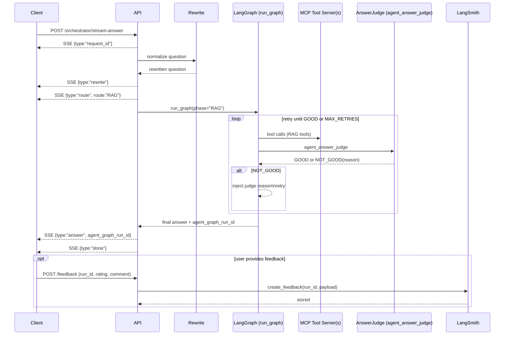

## 🔄 `/orchestrator/stream-answer` — SSE Execution Flow

This endpoint provides a **streaming, reliability-first orchestration pipeline** for answering questions using RAG tools.

It emits **Server-Sent Events (SSE)** so clients can observe each reasoning stage in real time.

---

### ✅ 1. Request Initialization

* The service **accepts or generates** a `request_id`.
* Immediately emits:

```json
{ "type": "request_id", "request_id": "<uuid>" }
```

This ID is propagated through:

* LangGraph runs
* MCP tool calls
* LangSmith traces
* Feedback API

---

### ✍️ 2. Rewrite Phase (Query Normalization)

Two-step rewrite ensures consistent retrieval and evaluation:

#### a. Deterministic rewrite

`rewrite_to_third_person()` converts:

```
"your experience" → "Taixing Bi’s experience"
"you" → "Taixing Bi"
```

This prevents ambiguity when querying personal knowledge collections.

#### b. LLM semantic rewrite

A lightweight LLM pass makes the query:

* clearer
* more specific
* retrieval-friendly
* evaluation-safe

SSE emission:

```json
{ "type": "rewrite", "text": "<rewritten question>" }
```

---

### 🧭 3. Route

The pipeline always runs the RAG phase when configured. SSE emission:

```json
{ "type": "route", "route": "RAG" }
```

---

### ⚙️ 4. Execution Phase

When RAG is configured, a single phase runs:

```
RAG
```

RAG enriches the answer with semantic context from the configured MCP tool.

---

### 🧠 5. `run_graph()` — LangGraph Agent Execution

The RAG phase invokes `run_graph()` which:


#### a. Runs the reliability loop:

```
LLM → Tool Calls → Evidence → Judge → Retry (if needed)
```

#### b. Captures the **root LangSmith run_id**

This becomes:

```
agent_graph_run_id
```

Used later for:

* Observability
* Human feedback
* Trace debugging
* Evaluation datasets

---

### 📤 6. Final Answer Emission

After the phase completes:

```json
{
  "type": "answer",
  "text": "<final answer>",
  "agent_graph_run_id": "<optional>"
}
```

---

### 🏁 7. Completion or Failure Signal

Success:

```json
{ "type": "done" }
```

Failure:

```json
{ "type": "error", "message": "<reason>" }
```

---

## 📡 Event Stream Example

```
request_id  → trace identity established
rewrite     → normalized query
route       → execution plan chosen
state       → phase progress updates
answer      → final grounded response
done        → stream completed
```

---

## 🧩 Why This Architecture Exists

This flow is intentionally designed to solve common LLM production failures:

| Problem                    | Solution in This Pipeline                       |
| -------------------------- | ----------------------------------------------- |
| Hallucination              | Tool-grounded LangGraph loop + judge validation |
| Wrong data source          | Single RAG tool (no routing)                    |
| Unobservable failures      | SSE phase visibility                            |
| Weak retrieval queries     | Dual-stage rewrite                              |
| User feedback disconnected | `agent_graph_run_id` links feedback → trace     |

---

## 🗺️ Simplified Sequence Diagram


---

This endpoint is the **primary production interface** for orchestrated LLM reasoning over RAG knowledge systems.
